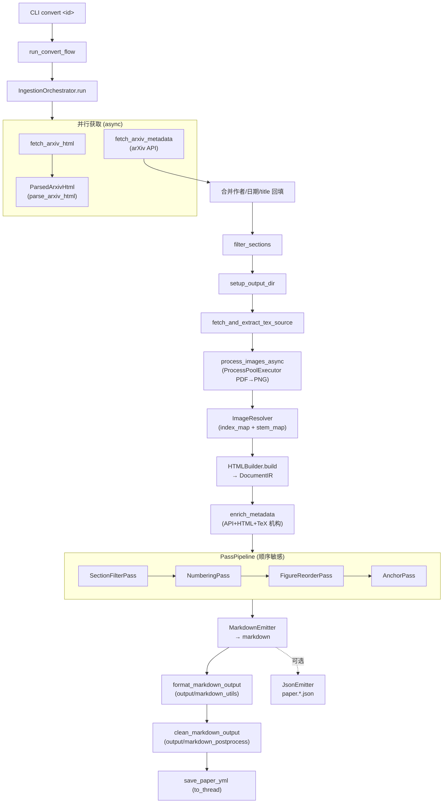
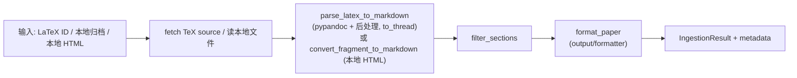

# arxiv2md-beta 架构

## 分层

```
CLI (typer)          cli/app.py, cli/convert_cli.py, cli/params.py, cli/runner/
   │
Ingestion            ingestion/orchestrator.py (IR), ingestion/{latex,local,local_html}.py (legacy)
   │
IR 三层              ir/builders → ir/transforms → ir/emitters   (ir/document.py 数据模型)
   │
输出                 output/{markdown_utils,formatter,layout,metadata,metadata_tex,structured_export,markdown_postprocess}
   │
基础设施             network/ (http,fetch,arxiv_api,crossref_api,openalex_api,author_enrichment)
                     images/processor.py, latex/ (parser,tex_source,author_affiliations,structured)
                     cache/result_cache.py, settings/, schemas/, utils/, query/parser.py
```

## 数据流（IR 路径，HTML 默认）



CPU 密集步骤（parse / build / transforms / emit）经 `asyncio.to_thread` 卸载，batch 模式下事件循环可并发推进多篇论文。

## 数据流（Legacy 路径：LaTeX / 本地）



Legacy 与 IR 共享：`output/markdown_utils`、`output/layout`、`output/metadata`、图片处理（`images/processor`）。

## 异常体系

```
Arxiv2mdError (exit_code)
├── UserInputError (2)        无效 CLI 输入 / 配置错误 (ConfigurationError)
├── NetworkError              HTTP 失败 (TexSourceNotFoundError)
├── ParseError                HTML/LaTeX 解析失败 (ParserNotAvailableError)
├── BuilderError              IR builder 失败
├── TransformError            IR transform 失败
├── EmitterError              IR emitter 失败（含未知节点类型）
├── IngestionError            管道失败 (LocalHtmlIngestionError, LocalIngestionError)
├── ImageProcessingError      图片处理失败 (PDFConversionError, ImageExtractionError)
└── StorageError              文件/缓存失败 (ArchiveExtractionError)
```

`cli/app.py::_handle_command_error` 把 `Arxiv2mdError` 映射到对应退出码；其它异常退 1。batch 模式 `except (Arxiv2mdError, OSError)` 收集 per-paper 错误。

## 关键设计约束

- **IR 层不接触格式特定源**：Builder 封装 BS4/Pandoc，Transform 是纯 IR，Emitter 直接走 IR 不回 parse。唯一泄漏是 raw fallback（未知 HTML 标签 → `RawBlockIR(format="html")`）与 LaTeX 脚注（现已改用 `LinkIR(kind="footnote")`）。
- **未知节点类型不静默丢弃**：`MarkdownEmitter` 对未处理的 Block/Inline 类型 `raise EmitterError`。
- **`_CHILD_SPECS` 必须覆盖所有容器节点**：`ir/visitor.py` 的 walker 用手维护表，新增容器类型未注册会导致 `walk()` 静默跳过子节点。有回归测试守护。
- **Pass 就地变异**：`PassPipeline` 不 deepcopy；同一文档重跑会重复编号。管线每文档只跑一次，安全。
- **共享 HTTP client 跨 loop 重建**：`get_http_client()` 检测 event loop 变化并重建；runner 顶层 `run_async` 优雅关闭。

## 已知技术债（后续）

- LaTeX + 本地模式尚未迁移到 IR（`LaTeXBuilder` 已存在但生产未用）。
- Markdown 后处理仍多遍；收敛为单遍需 golden-snapshot 校验。
- 双结构化导出器（`output/structured_export.py` vs `ir/emitters/json_emitter.py`）待统一。
- `output/formatter.py` 等 6 模块仍 `mypy ignore_errors`，随 legacy 退役逐步移除。
- `cache/result_cache.py` 未接入管线（仅 `config cache` 子命令用）。
