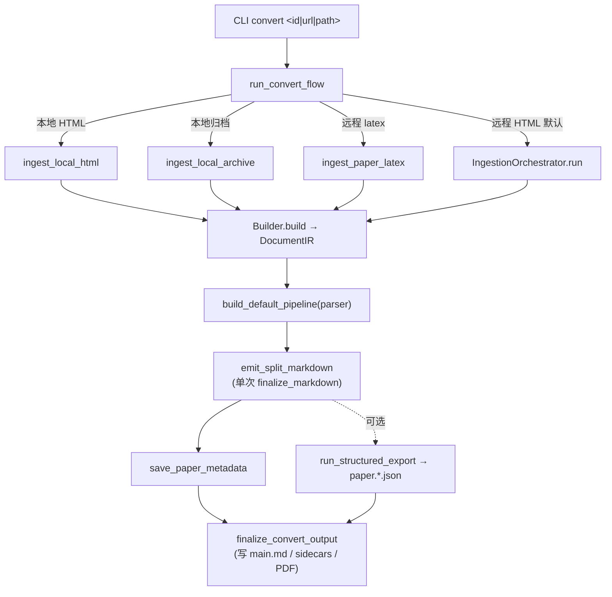

# arxiv2md-beta 架构

> 状态反映 2026-07-19 重构后（见 `docs/REVIEW_2026-07-19.md`）。IR 三层架构统一服务全部 4 种输入模式；编排尾与后处理已收敛为单一来源。

## 设计主导思想

**一个路由器，源逻辑可插拔；IR 是唯一中间表示；Emitter 拥有最终输出；Fail Fast；Schema 即契约。**

四条输入路径在"取源 + 建 IR"上各自不同（远程有 API 元数据 + 机构富化，本地无），但在"跑 pass → emit → 存盘 → 导出"上**共享同一尾部**。

## 分层

```
CLI (typer)          cli/app.py (命令注册) → cli/runner/{convert,batch,images,paper_yml}.py
   │
路由                 cli/runner/convert.py::run_convert_flow（4 路分支 → 汇聚到 output_finalize）
   │
Ingestion            ingestion/orchestrator.py（远程 HTML）+ ingestion/{latex,local,local_html}.py
                     共享尾：ingestion/ir_finalize.py（emit_split_markdown + run_structured_export）
   │
IR 三层              ir/builders → ir/transforms → ir/emitters  （ir/document.py 数据模型）
                     ir/transforms/pipeline.py::build_default_pipeline（唯一管线工厂）
   │
输出                 output/{markdown_utils,markdown_postprocess,metadata,metadata_tex,layout}
                     output/markdown_postprocess.py::finalize_markdown（单一后处理）
   │
基础设施             network/（http,fetch,arxiv_api,crossref_api,author_enrichment）
                     images/processor.py（async）, latex/{includes,tex_source,author_affiliations}.py
                     settings/, schemas/, utils/, query/parser.py
```

## 数据流（统一 IR 路径）



4 条路径最终都汇聚到 `cli/output_finalize.py::finalize_convert_output`，写 main markdown + references/appendix sidecars + 可选 PDF。

## IR 三层（`ir/`）

1. **Builder**（`ir/builders/{html,latex}.py`）：格式 → `DocumentIR`。封装全部 BS4 / Pandoc 逻辑，IR 层不接触原始格式（唯一泄漏是保底 `RawBlockIR(format=...)`，按设计保留原始内容不丢失）。
2. **Transform**（`ir/transforms/`）：`build_default_pipeline(parser=...)` 是**唯一**管线来源（`ir/transforms/pipeline.py`）。顺序敏感：
   `[SectionFilter?] → Numbering → [SectionNumbering?] → FigureReorder → Anchor`
   - `SectionNumberingPass` 仅 `parser="latex"`（对 HTML 是 no-op）。
   - `FigureReorderPass` 依赖 `NumberingPass` 填的 `figure_id`；`AnchorPass` 须最后。
   - Pass 就地变异 `DocumentIR`（每文档只跑一次，安全；重跑会重复编号）。
3. **Emitter**（`ir/emitters/`）：
   - `MarkdownEmitter`：`DocumentIR` → GitHub-flavored Markdown。`__init__` 接 `linked_citations` / `remove_inline_citations`。未知 Block/Inline 类型 `raise EmitterError`（不静默丢）。
   - `JsonEmitter`：`paper.{meta,document,assets,bib,graph}.json`，`SCHEMA_VERSION` 单一源（`schemas/structured.py`）。
   - `PlainTextEmitter`：token 计数 / 搜索；同样 fail-fast（未知类型 raise）。

## IR 数据模型

Pydantic v2 discriminated union（`Annotated[A|B|..., Field(discriminator="type")]`），`extra="forbid"`（单点配置 `ir/core.py`）。
- `ir/document.py`：`DocumentIR` / `SectionIR` / `PaperMetadata` / `AuthorIR`
- `ir/blocks.py`：`BlockUnion`（11 成员）
- `ir/inlines.py`：`InlineUnion`（9 成员）
- `ir/assets.py`：`AssetUnion`（3 成员）
- `walk()`（`ir/visitor.py`）覆盖 abstract / front_matter / sections / bibliography / assets / metadata.authors。`_CHILD_SPECS` 由 `test_child_specs_cover_all_container_types` 守护。

## 后处理（单次，emission 层）

`output/markdown_postprocess.py::finalize_markdown` = `format_markdown_output ∘ clean_markdown_output`（锚点换行、表格标题、display-math 简化、bullet 去重、空行压缩、可选剥锚点、数学 LaTeX 清洗、`$` 间距）。由 `emit_split_markdown` 在 emit 后**单次**应用；CLI finalize 层不再做第二遍。

## 异常体系

```
Arxiv2mdError (exit_code)
├── UserInputError (2)        无效 CLI 输入 / 配置错 / 缺依赖（PyYAML、BS4）
├── NetworkError              HTTP 失败（含 TexSourceNotFoundError）
├── ParseError                HTML/LaTeX/paper.yml 解析失败（含 ParserNotAvailableError）
├── BuilderError              IR builder 失败
├── TransformError            IR transform 失败
├── EmitterError              IR emitter 失败（含未知节点类型）
├── IngestionError            管道失败（LocalHtmlIngestionError, LocalIngestionError）
├── ImageProcessingError      图片处理失败（PDFConversionError）
└── StorageError              文件/归档失败（ArchiveExtractionError）
```

src 内 0 裸 `raise ValueError/RuntimeError`。`cli/app.py::_handle_command_error` 把 `Arxiv2mdError` 映射到退出码；其它异常退 1。batch 模式 `except (Arxiv2mdError, OSError)` 收集 per-paper 错误。

## 关键设计约束

- **IR 层不接触格式特定源**：Builder 封装 BS4/Pandoc，Transform 纯 IR，Emitter 走 IR 不回 parse。
- **未知节点类型不静默丢弃**：`MarkdownEmitter` / `PlainTextEmitter` 对未处理类型 `raise EmitterError`。
- **`build_default_pipeline` 是唯一管线来源**：4 路径全部调它；`SectionNumberingPass` 不对称漂移已修。
- **后处理单次单层**：emission 层 `finalize_markdown`；CLI finalize 不再后处理。
- **`SCHEMA_VERSION` 单一源**：`schemas/structured.py`，emitter import。
- **共享 HTTP client 跨 loop 重建**：`get_http_client()` 检测 event loop 变化并重建；`close_http_client()` / `run_async()` 顶层优雅关闭。
- **Fail Fast**：接线未通电的特性已处理（`--remove-inline-citations` 已实现；死结果缓存已删）；非法输入入口拒绝。

## 已知技术债（后续）

- `html/parser.py`(886) / `cli/app.py`(693) / `ingestion/local.py`(694) 三大模块拆分（authors 抽取、一命令一文件、latex/html 归档分离）——机械量大，建议各自独立 PR。
- `ir/builders/latex.py` 17 处 mypy（pandoc AST `Any`，需 TypedDict）。
- `_SETTINGS` 全局被 network/images 等 lookup（功能正确，全量 DI 需改大量签名 + 测试夹具）。
- 完整 Source 策略协议（4 路径前端进一步抽象）——当前共享尾已消除主要重复。
- `schemas/structured.py` coarse 模型与 emitter rich v2 输出的合并（需镜像 IR union 或重构 emitter）。
